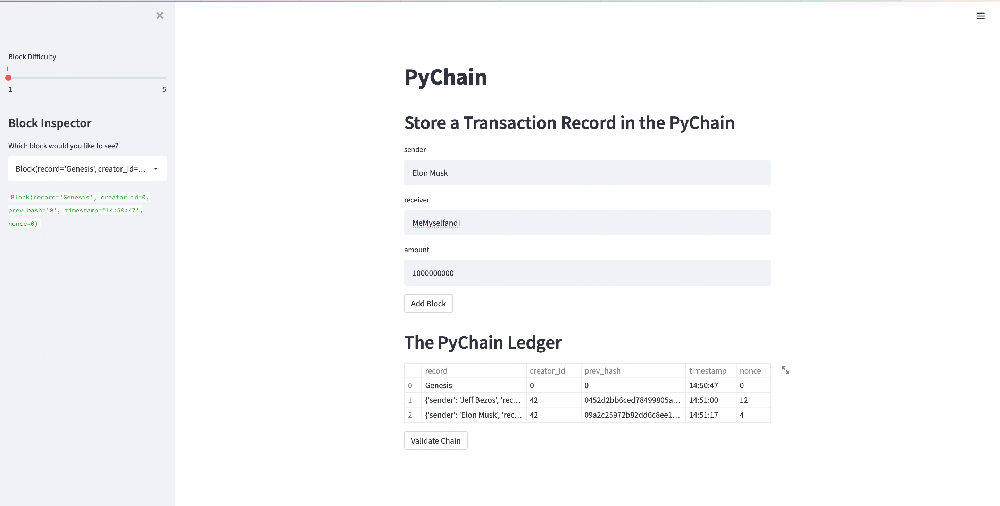

# Unit18_Blockchain_HW

The purpose of this task is to create a blockchain based ledger system.  The screenshots below will show you the ledger at difficulty levels of 1, 2 and 5.

## Difficulty Level 1

## Difficulty Level 2

## Difficulty Level 5

## Full Blockchain

## Blockchain Validation

